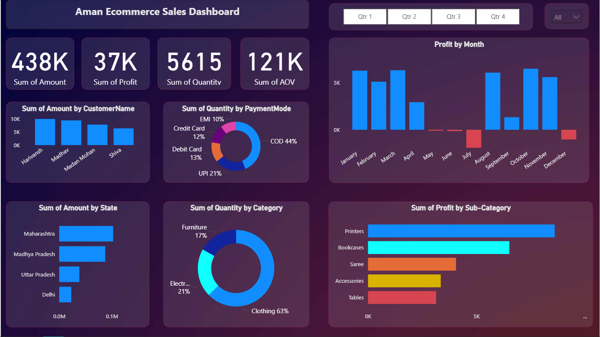

# 🛒 E-commerce Sales Dashboard (Power BI)

## 📌 Overview

This project contains an **E-commerce Sales Dashboard** built in **Power BI**.
It provides insights into **sales, profit, customer behavior, payment modes, and regional performance**.
The dashboard helps businesses monitor key KPIs, track sales trends, and optimize strategies.

---

## 🚀 Features

* **KPIs**

  * Total Sales Amount: **438K**
  * Total Profit: **37K**
  * Total Quantity: **5615**
  * Average Order Value (AOV): **121K**

* **Visuals**

  * Profit by Month (trend analysis)
  * Amount by Customer Name
  * Amount by State (regional sales)
  * Quantity by Category (Clothing, Electronics, Furniture, etc.)
  * Profit by Sub-Category (Printers, Bookcases, Saree, Accessories, Tables)
  * Quantity by Payment Mode (COD, UPI, Debit Card, Credit Card, EMI)

* **Filters**

  * Quarter-wise filter (Q1 – Q4)
  * Global filter for data selection

---

## 📂 Files

* `Details.pbix` → Power BI dashboard file
* `Orders.pbix` → Power BI dashboard file
* `Screenshot2.png` → Dashboard preview

---

## 🛠 Tools & Skills Used

* **Power BI Desktop**

  * DAX (Data Analysis Expressions)
  * Interactive Visualizations
  * Data Modeling
  * Drill-down Analysis

---

## 📸 Dashboard Preview

---

## 🔧 How to Use

1. Download the `.pbix` file.
2. Open in **Power BI Desktop** (latest version recommended).
3. Use filters (quarters, customers, payment modes) to explore sales data.
4. Analyze customer, product, and state-level performance.

---

## 💡 Insights You Can Gain

* Identify **top customers** driving revenue.
* Understand **sales trends across months & quarters**.
* Compare **profitability by product sub-category**.
* Evaluate **regional sales performance**.
* Analyze **preferred payment methods**.

---

## 📌 Future Enhancements

* Add **forecasting for sales & profit**.
* Automate refresh with a **database connection (SQL / API)**.
* Create **customer segmentation dashboards**.

---

## 👨‍💻 Author

**Raunak Patel**
📌 Computer Science Engineering Student
📊 Exploring Data Analytics & Visualization with Excel & Power BI

---
